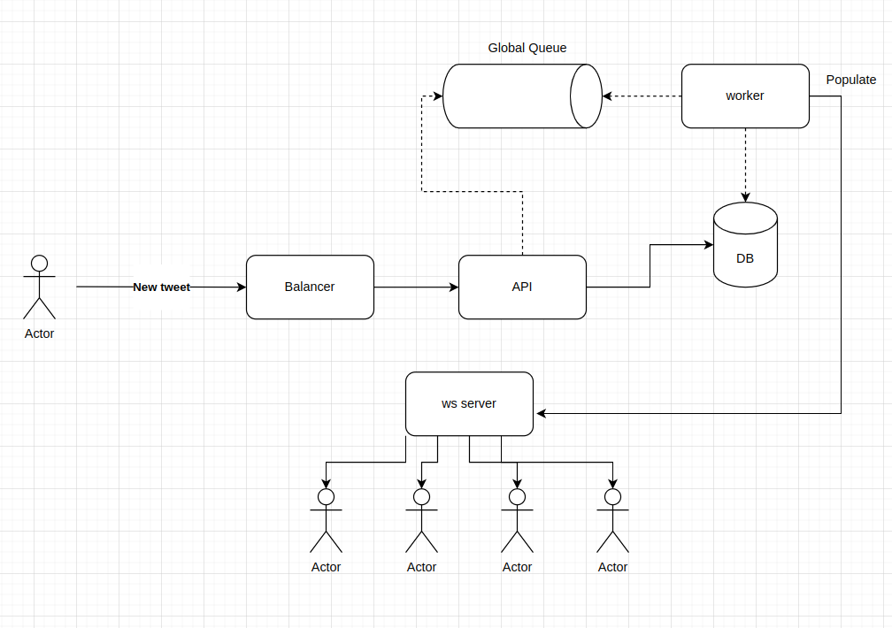
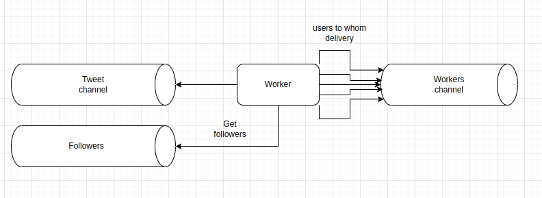
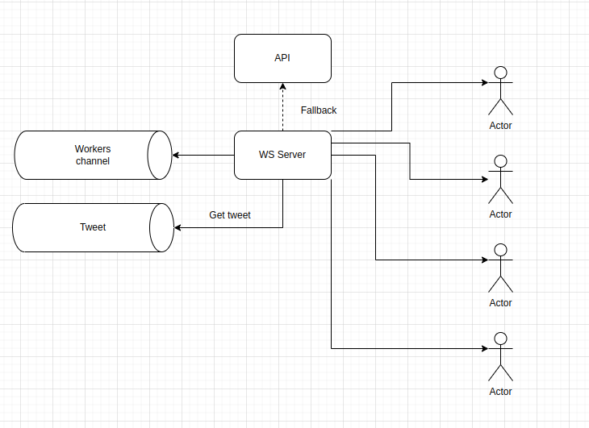
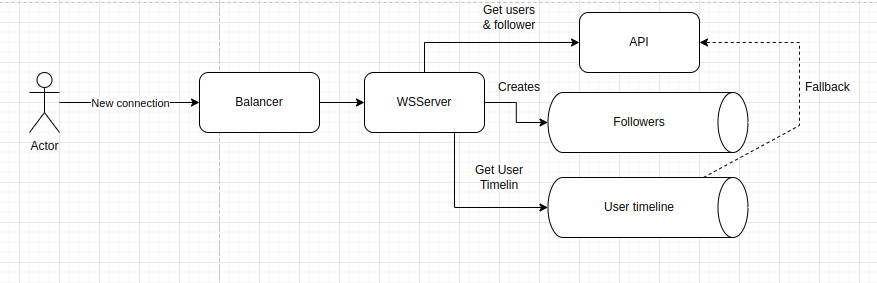

# Architecture Overview
Let me have 30 seconds to explain the architecture of application. 

It's a continuation of the Readme.

Let's break in, there are 5 components: 
1. **Redis**: For caching and subscriptions.
2. **PostgreSQL**: For storing user data and tweets.
3. **API Server**: For handling HTTP requests.
4. **Websocket Server**: For real-time communication.
5. **Workers**: For background tasks.

All this components are connected with each other, but they are independent and can be run on different machines if needed.

## Main Ideas

So for user there are 3 operations:
1. **Follow**: User can follow another user.
2. **Tweet**: User can post a
3. **Read timeline**: User can read the timeline of followed users.

Additionally, only API has access to the database and all other database communications are done over this API. This helps to secure it and to unify database communications. 

### Tweet

So the idea is that user tweets directly to the API. API does:
1. Validates the tweet.
2. Stores it in PostgreSQL.
3. Publishes a message to Redis about new tweet.

Then, workers listen for this messages and do:
1. Gets current followers of the user who tweeted.
2. Pushes the tweet to their feeds through the channel.

Worker works as a Centrifuge and can be replaced with the similar opensource solution. 

The idea is that, if there is no user followers, so we even don't need to public it to anyone feed.

And finally, the WS server gets from channel the tweet and user id and share it with connected user. It has an API fallback in a case if there is no tweet in cache.

### New connection & timeline

When user connects to the web socket server, we use it as a trigger that the user is online, so additional actions are performed:
1. Creating a followers list in Redis for this user.
2. Creating the timeline for this user in Redis
3. Sharing users timeline with him.

### Follow new user
This is the best part, because suing the API user follows the new user and this info is pushed to followers in cache.

## Hybrid model

All in all, the classic FAN-OUT model is used. Unfortunately, I hadn't had enough time to implement the hybrid, but there is some [notes](https://github.com/juy13/twitter-clone/blob/a4fdb8531dfd388b43240c0782061bd7277e7fd3/internal/server/worker/worker.go#L64) about this in worker. 

The idea is simple, if there are millions of subscribers, so we can't just send tweet to all of them. So on a client side, the requests to such users are implemented. So the client should check every 20-30s that the user (with million subscribers) posted anything. And this requires at list a user implementation, not a simple [python script](../scripts/user.py).

